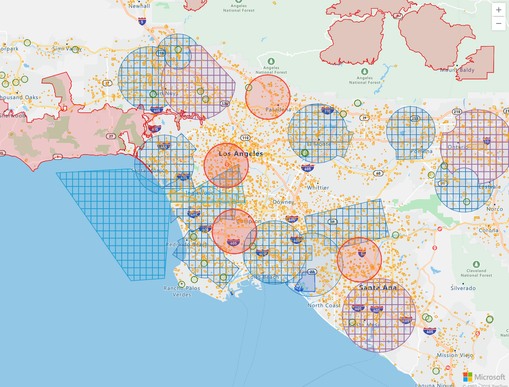

# AirMap's Azure Maps Contextual Airspace Plugin



## Introduction

A plugin for [Azure Maps](https://azure.microsoft.com/en-us/services/azure-maps/) that allows 
you to view and interact with [AirMap's Contextual Airspace](https://developers.airmap.com/docs/contextual-airspace-overview) advisory layers.

## Requirements

To use the AirMap Azure Maps Contextual Airspace Plugin, you must register as a developer and obtain an API key from the [AirMap Developer Portal](https://dashboard.airmap.io/developer).
Once your application has been created, simply copy the provided config JSON to provide to the Contextual Airspace Plugin.
You'll also need to register for a [Azure Maps Access Token](https://azure.microsoft.com/en-in/free/).

## Installation

### From AirMap's CDN

```html
<!-- Latest patch release -->
<script src="https://cdn.airmap.io/js/azure-maps-plugin/1.0.0/airmap.contextual-airspace-plugin.min.js"></script>

<!-- Latest minor release -->
<script src="https://cdn.airmap.io/js/azure-maps-plugin/1.0.0/airmap.contextual-airspace-plugin.min.js"></script>
```

### From [npm](https://npmjs.org)

```sh
npm install js-azure-maps-plugin
```

> After installing the `js-azure-maps-plugin` module via npm or bower, you'll need bundle it up along with its dependencies
using a tool like [webpack](https://webpack.github.io/) or [browserify](https://browserify.org). If you don't have a
build process in place for managing dependencies, it is recommended that you use the module via the CDN.
[See below](#with-webpack) for instructions on using with webpack and browserify. If you install with bower and intend
to support ES5, you will also need to run your bundle through [babel](https://babeljs.io/).

## Usage

Here's an example of a minimal setup. See [Documentation](#documentation) for more details.

```html
<!doctype html>
<html>
    <head>
        <title>Azure Maps Contextual Airspace Plugin</title>
        <meta name="viewport" content="width=device-width, initial-scale=1.0, maximum-scale=1.0, user-scalable=no" />
        <script src="https://cdn.airmap.io/js/azure-maps-plugin/1.0.0/airmap.contextual-airspace-plugin.min.js" async=false defer=false></script>
        <link rel="stylesheet" href="https://atlas.microsoft.com/sdk/css/atlas.min.css?api-version=1" type="text/css" />
        <script src="https://atlas.microsoft.com/sdk/js/atlas.min.js?api-version=1"></script>
    
        <!-- Add a reference to the Azure Maps Services Module JavaScript file. -->
        <script src="https://atlas.microsoft.com/sdk/js/atlas-service.js?api-version=1"></script>
        <style>
            body { margin: 0; padding: 0; }
            .map {
                position: absolute;
                width: 100%;
                height: 100%;
                top: 0;
                right: 0;
            }
        </style>
    </head>
    <body>
        <div id="map" class="map"></div>
        <script>
            const AIRMAP_API_KEY = '<AIRMAP_API_KEY>'
            const AZURE_ACCESS_TOKEN = '<AZURE_ACCESS_TOKEN>'
            if (AIRMAP_API_KEY && AZURE_ACCESS_TOKEN) {
                atlas.setSubscriptionKey(AZURE_ACCESS_TOKEN);
                //Initialize a map instance.
                const map = new atlas.Map("map", {
                    center: [-118.270293, 34.039737],
                    zoom: 8,
                    style: "road"
                });
                const config = {
                    "airmap": {
                        "api_key": AIRMAP_API_KEY
                    },
                    "auth0": {
                        "client_id": "",
                        "callback_url": ""
                    },
                    "atlas": {
                        "access_token": AZURE_ACCESS_TOKEN
                    }
                }
                const options = {
                    preferredRulesets: [
                        'usa_part_107',
                        'deu_rules_waiver'
                    ],
                    overrideRulesets: [
                        // 'usa_part_107'
                    ],
                    enableRecommendedRulesets: true,
                    theme: 'light'
                }
                const plugin = new AirMap.ContextualAirspacePlugin(config, options, atlas);
                //Wait until the map resources have fully loaded.
                map.events.add('load', function () {
                    //Add the zoom control to the map.
                    map.controls.add(new atlas.control.ZoomControl(), {
                        position: 'top-right'
                    });
                    map.controls.add(plugin, 'bottom-right')
                });

                // Example for how ruleset changes are surfaced to the consuming application.
                plugin.on('jurisdictionChange', (data) => console.log('jurisdictionChange', data))
                plugin.on('airspaceLayerClick', (data) => console.log('airspaceLayerClick', data))
                
            } else {
                console.error(
                    'Missing AIRMAP_API_KEY or AZURE_ACCESS_TOKEN. ' +
                    'These are required for developing locally.\n\n' +
                    'Please save these values in localStorage by entering the following in your browser console:\n\n' +
                    'localStorage.setItem(\'AIRMAP_API_KEY\', \'<your_key>\');\n' +
                    'localStorage.setItem(\'AZURE_ACCESS_TOKEN\', \'<your_token>\');\n\n'
                );
            }
        </script>
    </body>
</html>
```

Or if using from NPM:

```javascript
import ContextualAirspacePlugin from 'js-azure-maps-plugin'

atlas.setSubscriptionKey(AZURE_ACCESS_TOKEN);
//Initialize a map instance.
const map = new atlas.Map("map", {
    center: [-118.270293, 34.039737],
    zoom: 8,
    style: "road"
});

const config = {
    "airmap": {
        "api_key": AIRMAP_API_KEY
    },
    "auth0": {
        "client_id": "",
        "callback_url": ""
    },
    "atlas": {
        "access_token": AZURE_ACCESS_TOKEN
    }
}
const options = {
    preferredRulesets: [
        'usa_part_107',
        'deu_rules_waiver'
    ],
    overrideRulesets: [
        // 'usa_part_107'
    ],
    enableRecommendedRulesets: true,
    theme: 'light'
}
const plugin = new ContextualAirspacePlugin(config, options, atlas)
//Wait until the map resources have fully loaded.
map.events.add('load', function () {
    //Add the zoom control to the map.
    map.controls.add(new atlas.control.ZoomControl(), {
        position: 'top-right'
    });
    map.controls.add(plugin, 'bottom-right')
});
```

### Prebuilt

If you are installing the Contextual Airspace Plugin with npm, a prebuilt package is also available in `dist/airmap.contextualairspaceplugin.min.js`. This will
allow you to use the Contextual Airspace Plugin without changing your webpack/browserify configuration. However, using your bundler to package
all dependencies is the preferred approach (webpack recommends against using prebuilt files).

## Documentation

> [Generated API Documentation](API.md)

> [Official AirMap Docs](https://developers.airmap.com/docs/getting-started-with-airmap)

### Developing

[Clone the repo](https://github.com/airmap/js-azure-maps-plugin) and run `npm install`. Then run `npm start` and navigate to
[http://localhost:8080/](http://localhost:8080/) in your browser. The server will
listen for changes and live reload as updates are made.

If this is your first time developing with the Contextual Airspace plugin, you'll need to store an AirMap API Key and Mapbox Access Token
in your localStorage for use on the `http://localhost:8080/` demo page:

```javascript
localStorage.setItem('AIRMAP_API_KEY', '<your_key>');
localStorage.setItem('AZURE_ACCESS_TOKEN', '<your_token>');
```

Once this is done, you won't need to do it again unless you clear your browser's localStorage.

```
$ npm install
$ npm start
$ open http://localhost:8080/
```

## License

> See [LICENSE](LICENSE.md) for details.

